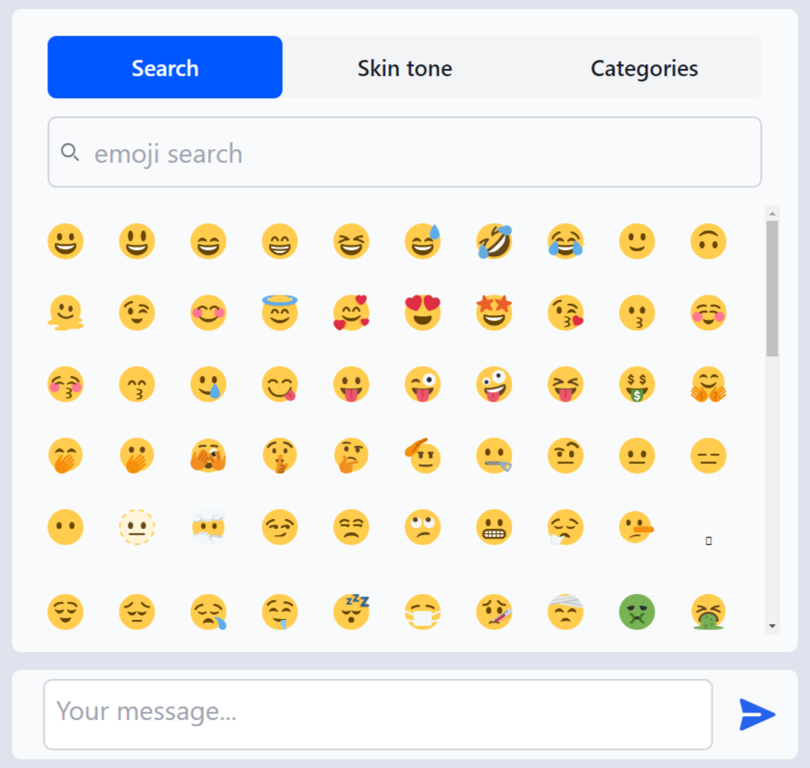

# SolidJS Emoji Picker App

A highly inspired SolidJS emoji picker app, based on [lxsmnsyc/solid-emoji-picker](https://github.com/lxsmnsyc/solid-emoji-picker). 

This emoji picker offers a smooth UI with features like emoji search, skin tone selection, and category filtering. 

You can also easily customize its styling to fit your application's design.




## Installation

To use this SolidJS emoji picker in your project, follow these simple steps:

1. Clone this repo and Run the commands:

```bash
$ npm install # or pnpm install 

```

2. Import and use the EmojiPickerApp component in your SolidJS application:

```javascript
import EmojiPickerApp from 'emoji-app';

export default function YourComponent(): JSX.Element {
  return (
    <EmojiPickerApp />
  );
}
```

## About

The SolidJS emoji picker app provides an easy-to-use interface for selecting emojis. It comes with the following features:


- Emoji Search: Quickly find the emoji you need by typing in keywords.


- Skin Tone Selection: Easily select the desired skin tone for supported emojis.


- Category Filtering: Organize emojis into categories for better navigation.


- Custom Styling: Customize the emoji picker's appearance to match your application's design.


## Available Scripts

In the project directory, you can run:

### `npm run dev` or `npm start`

Runs the app in the development mode.<br>
Open [http://localhost:3000](http://localhost:3000) to view it in the browser.

The page will reload if you make edits.<br>

### `npm run build`

Builds the app for production to the `dist` folder.<br>
It correctly bundles Solid in production mode and optimizes the build for the best performance.

The build is minified and the filenames include the hashes.<br>
Your app is ready to be deployed!

## Deployment

You can deploy the `dist` folder to any static host provider (netlify, surge, now, etc.)
